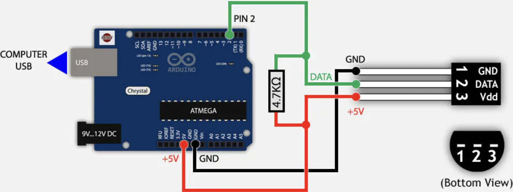

# DS18B20 Temperature Sensor

This Arduino program is intended to initialize and test the DS18B20 temperature sensor on an Arduino Uno, and has been verified to work as of July 2020. This sensor works differently than the cheaper DHT11 and DHT22 sensors and have faster read times.

### Benefits of using this sensor vs. DHT11:
- Able to test temperature in air, ground or water.
- Uses one wire to transmit temperature data and able to add many sensors onto one data bus.
- Measures temperatures from –55°C to +25°C (–67°F to +257°F) ± 0.5
- Alarm search command allows user to easily set behavior for a dangerous temp reading.

### Sensor Applications
Practical applications include: Thermostatic controls, electronics enclosures, thermometers, or any thermally sensitive system (custom CPU-case temp read-out anyone?)

### Circuit

###  Bad Sensor Behavior
If the sensor outputs a reading of -127 degrees, then the sensor is fried and a new one should be replaced.

### Further Documentation
Elegoo's 37 Sensor Kit Tutorial PDF (Page 71)
